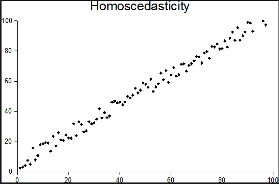
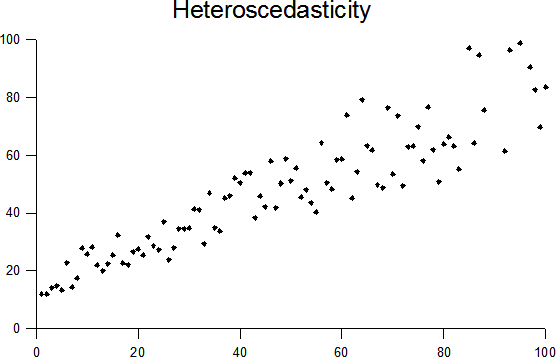
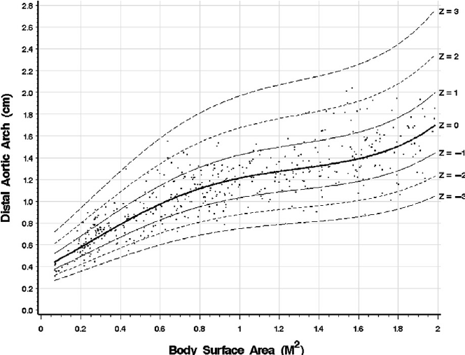

# Variance Ratio Test [](https://GitHub.com/Naereen/)

[](https://shields.io/) [](https://GitHub.com/Naereen/StrapDown.js/graphs/commit-activity) [](http://ansicolortags.readthedocs.io/?badge=latest) 

A comprehensive implementation of the Variance Ratio Test following Lo & MacKinlay (1988), providing statistical tools for examining the stochastic evolution of financial log price series. The test evaluates the Random Walk Hypothesis (Efficient Markets Hypothesis) by comparing variance estimators at different sampling intervals.

## Overview

The Variance Ratio Test investigates market efficiency by testing whether log price increments follow a random walk. The implementation supports testing under different null hypotheses to assess the quality of market efficiency:

### Null Hypotheses

- **Homoskedastic Increments** (*strong market efficiency*): The disturbances/increments are IID (independently and identically distributed) normal random variables, where the variance of increments is a linear function of the observation interval. This hypothesis corresponds to the Brownian Motion model.



- **Heteroskedastic Increments** (*semi-strong market efficiency*): The disturbances/increments are independent but not identically distributed (INID). The variance of increments is a non-linear function of the observation interval. This hypothesis corresponds to the Heston Model.



- **Model-Dependent Increments** (*weak market efficiency*): The third form relaxes the independence assumption, allowing for conditional heteroskedastic increments. The volatility has either a non-linear structure (conditional on itself) or is conditional on another random variable. Stochastic processes employing ARCH (Autoregressive Conditional Heteroscedasticity) and GARCH (Generalized AutoRegressive Conditional Heteroscedasticity) models belong to this category.



## Installation

### Requirements

```bash
pip install -e .
```

### Python Version

Python 3.11 or higher is required.

## Usage

### Basic Usage with EMH Class

```python
import numpy as np
from variance_test import EMH

# Generate or load log prices (NOT actual prices)
# The VRT expects log prices where differences are log returns
np.random.seed(42)
log_prices = np.log(np.cumsum(np.random.randn(201)) * 0.01 + 100)

# Initialize the Efficient Market Hypothesis tester
emh = EMH()

# Run the variance ratio test
# q: aggregation horizon (e.g., q=2 for 2-period returns)
# heteroskedastic: True for heteroskedastic null, False for homoskedastic null
z_score, p_value = emh.vrt(
    X=log_prices,
    q=2,
    heteroskedastic=False,  # Use homoskedastic test
    centered=True,
    unbiased=True,
    annualize=False
)

print(f"z-statistic: {z_score:.4f}")
print(f"p-value: {p_value:.4f}")
```

### Running Simulations

The package includes a comprehensive simulation framework to test the VRT on different stochastic processes:

```bash
python -m variance_test.simulation --series 10 --horizon 100 --aggregation 3 --seed 42 --no-plot
```

#### Command Line Arguments

- `--series`: Number of trajectories to simulate per model (default: 10)
- `--horizon`: Number of observations per trajectory (default: 100)
- `--initial-price`: Initial price for each trajectory (default: 100.0)
- `--mu`: Mean of return trajectories (default: 0.09)
- `--sigma`: Base volatility (default: 0.1)
- `--jump-intensity`: Jump intensity for Merton process (default: 50.0)
- `--kappa`: Mean reversion speed for Heston model (default: 0.1)
- `--theta`: Target variance level in Heston (default: 0.06)
- `--rf`: Risk-free rate for Heston (default: 0.02)
- `--aggregation`: Aggregation horizon for VRT statistic (default: 5)
- `--homoskedastic`: Use homoskedastic null hypothesis instead of heteroskedastic
- `--seed`: Random seed for reproducibility
- `--no-plot`: Skip displaying density comparison plot

### Simulation Example with Python

```python
from variance_test import SimulationConfig, run_simulation

config = SimulationConfig(
    num_series=5,
    horizon=200,
    initial_price=100.0,
    mu=0.05,
    sigma=0.2,
    aggregation_horizon=2,
    heteroskedastic=False,
    seed=42
)

results = run_simulation(config)

print(f"Generated {len(results.processes)} price processes")
print(f"Mean z-score: {results.z_scores.mean():.4f}")
print(f"Mean p-value: {results.p_values.mean():.4f}")
```

## Implementation Details

### Variance Ratio Test

The implementation follows **Lo & MacKinlay (1988)** exactly:

1. **Variance Ratio Calculation**:
   - VR(q) = σ̂²_a(q) / σ̂²_b(q)
   - σ̂²_a(q): Variance of non-overlapping q-period returns
   - σ̂²_b(q): Weighted sum of autocovariances per equation (6a)

2. **Test Statistic** (Homoskedastic):
   - z(q) = M(q) × √(nq) / √θ(q)
   - M(q) = VR(q) - 1
   - θ(q) = [2(2q-1)(q-1)] / (3q)
   - Per equation (8) in Lo & MacKinlay (1988)

3. **Test Statistic** (Heteroskedastic):
   - z(q) = M(q) × √(nq) / √v̂(q)
   - v̂(q): Asymptotic variance under heteroskedasticity
   - Uses weighted delta statistics

### Price Path Generation

The `price_paths.py` module generates price trajectories for various stochastic processes:

- **Geometric Brownian Motion (GBM)**: dS = μS dt + σS dW
- **Merton Jump Diffusion**: GBM with Poisson jumps
- **Heston Stochastic Volatility**: Mean-reverting volatility process
- **Vasicek Interest Rate Model**: Mean-reverting rates
- **Cox-Ingersoll-Ross (CIR)**: Square-root diffusion process
- **Ornstein-Uhlenbeck Process**: Mean-reverting process

**Important**: All price path generators return **actual prices**, not log prices. The simulation framework automatically converts these to log prices before applying the VRT.

### Key Features

- ✅ Correct implementation of Lo & MacKinlay (1988) formulas
- ✅ Both homoskedastic and heteroskedastic tests
- ✅ Proper handling of log prices vs. actual prices
- ✅ Edge case handling for small samples
- ✅ Multiple stochastic process simulations
- ✅ Comprehensive testing framework

## Mathematical Foundation

### Variance Ratio Definition

For a log price series X_t, the variance ratio at horizon q is:

```
VR(q) = Var[X_t - X_{t-q}] / (q × Var[X_t - X_{t-1}])
```

Under the random walk null hypothesis, VR(q) should equal 1.

### Weighted Autocovariance Formula

The denominator σ̂²_b(q) is computed as:

```
σ̂²_b(q) = Σ_{j=0}^{q-1} [2(q-j)/q] × γ̂(j)
```

where γ̂(j) is the j-th lag sample autocovariance with unbiased denominator (n-j).

## Interpretation

The Variance Ratio test results do not necessarily imply that the stock market is inefficient or that prices are not rational assessments of fundamental values. The test is purely a **descriptive tool** for examining the stochastic evolution of prices through time.

- **VR(q) > 1**: Positive serial correlation (momentum)
- **VR(q) < 1**: Negative serial correlation (mean reversion)
- **VR(q) ≈ 1**: Consistent with random walk hypothesis

### Statistical Significance

- Use the z-statistic to test the null hypothesis that VR(q) = 1
- Under the null, z follows a standard normal distribution
- Reject the null if |z| > 1.96 (5% significance level)

## References

### Primary Sources

- Lo, Andrew W. and MacKinlay, Archie Craig, **Stock Market Prices Do Not Follow Random Walks: Evidence from a Simple Specification Test** (February 1987). NBER Working Paper No. w2168. Available at SSRN: https://ssrn.com/abstract=346975

- Lo, Andrew W. and MacKinlay, Archie Craig, **The Size and Power of the Variance Ratio Test in Finite Samples: a Monte Carlo Investigation** (June 1988). NBER Working Paper No. t0066. Available at SSRN: https://ssrn.com/abstract=396681

### Additional Resources

- Stuart Reid | On February. "Stock Market Prices Do Not Follow Random Walks." Turing Finance, 8 Feb. 2016, www.turingfinance.com/stock-market-prices-do-not-follow-random-walks/

- "Variance Ratio Test." Breaking Down Finance, [breakingdownfinance.com/finance-topics/finance-basics/variance-ratio-test/](breakingdownfinance.com/finance-topics/finance-basics/variance-ratio-test/)

## Project Structure

```
variance-test/
├── src/
│   └── variance_test/
│       ├── __init__.py
│       ├── core.py               # Core VRT implementation (EMH class)
│       ├── price_paths.py        # Stochastic process generators
│       ├── simulation.py         # Simulation framework and CLI
│       └── visuals.py            # Plotting utilities
├── examples/
│   └── empirical_application.py  # Optional external example (uses external deps)
├── tests/
├── pyproject.toml
├── README.md
└── LICENSE
```

The historical internal module `variance_test.py` was renamed to `core.py` to avoid colliding with the package name. Import public symbols from `variance_test`.

## Recent Updates

### Version 2.0 (January 2026)

**Critical Fixes to Variance Ratio Test Implementation**:

1. ✅ Fixed inverted variance ratio formula (was σ_b²/σ_a², now σ_a²/σ_b²)
2. ✅ Corrected σ_b calculation using weighted autocovariances per Lo & MacKinlay equation (6a)
3. ✅ Fixed test statistic scaling (removed extra √q factor)
4. ✅ Fixed autocovariance denominators to use (n-j) per standard convention
5. ✅ Added edge case handling for boundary conditions
6. ✅ Fixed simulation.py to convert actual prices to log prices before VRT

These fixes ensure the implementation exactly matches the Lo & MacKinlay (1988) methodology and produces statistically correct results.

## Contributing

Contributions are welcome! Please ensure any changes:
- Follow the Lo & MacKinlay (1988) methodology
- Include comprehensive tests
- Update documentation accordingly
- Pass all existing tests

## Future Work

- Distribution of the code as a PyPI package
- Step-by-step explanation for QuantConnect integration
- Implementation of Long Term Memory in Stock Market Prices (Lo, 1989)
- Additional market efficiency tests

## License

See LICENSE file for details.

## Citation

If you use this implementation in your research, please cite:

```bibtex
@software{variance_ratio_test,
  title = {Variance Ratio Test Implementation},
  author = {Parada, Lautaro},
  year = {2026},
  url = {https://github.com/LautaroParada/variance-test},
  note = {Implementation following Lo \& MacKinlay (1988)}
}
```