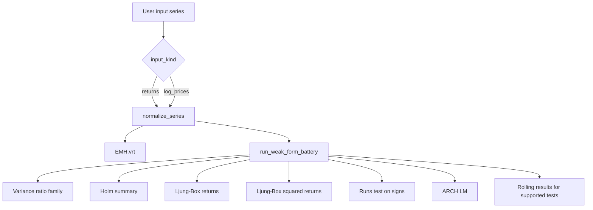
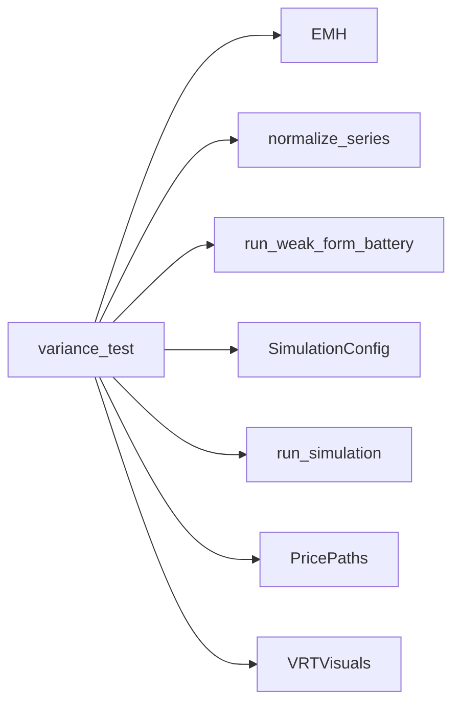

# variance-test 

[](https://pypi.org/project/variance-test/)
[](https://pypi.org/project/variance-test/)
[](https://github.com/LautaroParada/variance-test/blob/master/LICENSE)

Testing whether a return series is compatible with a random walk usually means stitching together a variance ratio implementation, a Ljung-Box call, an ARCH-LM check, a runs test, and some ad-hoc glue code to normalize inputs and interpret results. Then you repeat it for rolling windows. Then you do it again for the next asset.

`variance-test` replaces that workflow with a single structured call.

```python
from variance_test import BatteryConfig, run_weak_form_battery

outcome = run_weak_form_battery(returns, config=BatteryConfig(input_kind="returns"))

print(outcome.multiple_testing["battery_summary"])
```

One call. Structured output. Mean dependence, sign dependence, volatility dependence, and multiple testing correction included.

## Installation

```bash
pip install variance-test
```

For development:

```bash
pip install -e .
```

## Quick start

### Variance ratio test only

```python
import numpy as np
from variance_test import EMH

rng = np.random.default_rng(42)
returns = rng.normal(0.0, 0.01, size=2000)

emh = EMH()
z_score, p_value = emh.vrt(
    X=returns,
    q=4,
    input_kind="returns",
    heteroskedastic=True,
    centered=True,
    unbiased=True,
    annualize=False,
    alternative="two-sided",
)

print("z_score:", z_score)
print("p_value:", p_value)
```

### Full weak-form battery

```python
import numpy as np
from variance_test import BatteryConfig, run_weak_form_battery

rng = np.random.default_rng(42)
returns = rng.normal(0.0, 0.01, size=2000)

config = BatteryConfig(
    input_kind="returns",
    alpha=0.05,
    q_list=(2, 4, 8),
    ljung_box_lags=(5, 10, 20),
    runs_test=True,
    arch_lm_lags=5,
)

outcome = run_weak_form_battery(returns, config=config)

# Holm-corrected VR family decision
print("VR family rejects:", outcome.tests["variance_ratio_holm"].reject_null)

# Full battery summary
print(outcome.multiple_testing["battery_summary"])
```

### Battery with rolling windows

```python
import numpy as np
from variance_test import BatteryConfig, run_weak_form_battery

rng = np.random.default_rng(123)
returns = rng.normal(0.0, 0.01, size=1500)

config = BatteryConfig(
    input_kind="returns",
    q_list=(2, 4),
    ljung_box_lags=(5, 10),
    runs_test=True,
    arch_lm_lags=5,
    rolling_window=120,
    rolling_step=20,
)

outcome = run_weak_form_battery(returns, config=config)

print("n_windows:", outcome.rolling["n_windows"])
print("first_vr_windows:", outcome.rolling["tests"]["variance_ratio_q2"][:2])
```

### Empirical application

```python
import numpy as np
from variance_test import EMH, BatteryConfig, run_weak_form_battery

# Replace with your own data source
prices = np.array([100.0, 101.5, 100.8, 102.2, 103.1, 101.9, ...])
log_prices = np.log(prices)

# Single test
emh = EMH()
z, p = emh.vrt(X=log_prices, q=5, input_kind="log_prices", heteroskedastic=True)
print(f"VR test: z={z:.4f}, p={p:.4f}")

# Full battery on returns
returns = np.diff(log_prices)
config = BatteryConfig(
    input_kind="returns",
    q_list=(2, 4, 8, 16),
    ljung_box_lags=(5, 10, 20),
    rolling_window=252,
    rolling_step=21,
)
outcome = run_weak_form_battery(returns, config=config)
print(outcome.multiple_testing["battery_summary"])
```

## What the battery includes

| Test | Diagnostic target | Rolling support |
|---|---|---|
| Variance ratio multi-q | Mean dependence at multiple horizons | Yes |
| Holm-Bonferroni correction | Family-wise error control for VR tests | No |
| Ljung-Box on returns | Serial dependence in returns | Yes |
| Ljung-Box on squared returns | Serial dependence in volatility | Yes |
| Runs test on signs | Non-random sign patterns | No |
| ARCH LM | Conditional heteroskedasticity | No |

The battery output classifies rejections into three categories: **mean dependence**, **sign dependence**, and **volatility dependence**. The summary field aggregates these into a single `weak_form_evidence_against_null` flag.

## Input formats

The package accepts two input modes:

* `input_kind="returns"` for one-period log-returns
* `input_kind="log_prices"` for cumulative log-price series

Both modes produce identical test statistics for equivalent data. This is tested and enforced in the test suite.

If you have raw prices:

```python
import numpy as np

prices = np.array([100.0, 101.5, 100.8, 102.2])
log_prices = np.log(prices)
returns = np.diff(log_prices)
```

## Main interfaces

### `EMH().vrt(...)`

Low-level variance ratio test.

| Parameter | Description |
|---|---|
| `X` | 1-D input series |
| `q` | Aggregation horizon |
| `input_kind` | `"returns"` or `"log_prices"` |
| `heteroskedastic` | Use heteroskedastic asymptotic variance (Lo & MacKinlay Z2) |
| `centered` | Centered statistic |
| `unbiased` | Unbiased variance/autocovariance estimators |
| `annualize` | Scaling flag for intermediate volatility estimators |
| `alternative` | `"two-sided"`, `"greater"`, or `"less"` |

Returns `(z_score, p_value)`.

### `normalize_series(...)`

Shared normalization used internally. Exposed for users who want direct access to the canonical representation.

```python
from variance_test import normalize_series

ns = normalize_series([0.01, -0.02, 0.015], input_kind="returns")
# ns.log_prices, ns.returns, ns.squared_returns, ns.signs, ns.n_returns
```

### `run_weak_form_battery(...)`

Full diagnostic pass. Returns a `BatteryOutcome` with:

* `tests` -- individual `TestOutcome` objects per test
* `multiple_testing` -- Holm summary and battery summary
* `rolling` -- rolling-window results (when configured)
* `warnings` -- non-computable test warnings

## How to read the results

**Variance ratio:** `VR(q) > 1` suggests positive serial dependence. `VR(q) < 1` suggests mean reversion. `VR(q) ≈ 1` is compatible with the random walk null.

**p-values:** Low p-value means the data is less compatible with the null hypothesis.

**Battery summary:** The battery provides statistical evidence against compatibility with weak-form efficiency under its test design. It does not constitute proof of market inefficiency. A rejection means the series shows detectable structure under the selected diagnostics.

## Implementation details

### Variance ratio estimator

The implementation uses **overlapping q-period increments** for the q-period variance estimator:

```
σ²_a(q) = (1 / ((n_q - 1) · q)) · Σ (X_{t} - X_{t-q} - q·μ̂)²
```

where the sum runs over all overlapping windows `t = q, q+1, ..., T`, and `μ̂ = (X_T - X_0) / T`.

The one-period variance estimator uses standard first differences:

```
σ²_b = (1 / (n₁ - 1)) · Σ (X_{t} - X_{t-1} - μ̂)²
```

The centered ratio is `M_r(q) = (σ²_a / σ²_b) - 1`.

Under the **homoskedastic null** (Lo & MacKinlay Z1), the asymptotic variance is `2(2q-1)(q-1) / (3q)`.

Under the **heteroskedastic null** (Lo & MacKinlay Z2), the asymptotic variance uses the `δ̂(j)` estimator:

```
δ̂(j) = (nq · Σ (ΔX_{t} - μ̂)² · (ΔX_{t-j} - μ̂)²) / (Σ (ΔX_{t} - μ̂)²)²
```

with weights `(2(q-j)/q)²` for `j = 1, ..., q-1`.

Edge cases where `q < 2`, sample sizes are insufficient, or variance estimates are non-positive raise explicit `ValueError` exceptions instead of producing silent NaN or incorrect results.

### References

* Lo, A.W. and MacKinlay, A.C. "Stock Market Prices Do Not Follow Random Walks: Evidence from a Simple Specification Test." *Review of Financial Studies*, 1(1), 1988.
* Lo, A.W. and MacKinlay, A.C. "The Size and Power of the Variance Ratio Test in Finite Samples: A Monte Carlo Investigation." *Journal of Econometrics*, 40(2), 1989.

## Correctness and testing

The implementation was [audited for statistical correctness](AUDIT.md). Three issues were identified and resolved:

1. **σ²_a estimator ignoring q-aggregation** (severity: high) -- the original loop computed first differences regardless of `q`. Fixed with overlapping q-period differences using `X[t] - X[t-q]`.
2. **Division by zero in unbiased σ²_b adjustment** (severity: medium) -- when `len(X) == q`, the denominator `m` collapsed to zero. Fixed with explicit validation that degrees of freedom are positive before division.
3. **v̂ degenerate for q < 3** (severity: medium) -- for `q = 1` or `q = 2`, the summation range in the heteroskedastic estimator was empty, producing `v̂ = 0` and a subsequent division by zero. Fixed with an explicit guard requiring `q ≥ 2` and `v̂ > 0`.

The package is covered by an automated test suite that validates calibration, detection, edge cases, rolling-window behavior, and input-mode equivalence. Key coverage includes:

* IID Gaussian non-rejection at α=0.01 for the selected battery components covered by the test suite (`variance_ratio_holm`, `ljung_box_returns`, `runs_test_signs`, `arch_lm`)
* AR(1) detection of serial dependence with VR family and Ljung-Box rejection
* ARCH-like data detection of volatility clustering via Ljung-Box squared returns and ARCH LM
* Alternating sign rejection via runs test
* Exact equivalence between `returns` and `log_prices` input modes for all comparable test outcomes
* p-value/reject_null consistency enforcement in all TestOutcome instances
* Rolling window index monotonicity, count formulas, and non-computable window handling
* Edge cases: all-zero returns, insufficient samples, incompatible lag/horizon combinations

CI runs on Python 3.11 and 3.12 on every push and pull request.

## Simulation support

The package includes simulation utilities for synthetic experimentation.

```python
from variance_test import SimulationConfig, run_simulation

config = SimulationConfig(
    num_series=5,
    horizon=200,
    initial_price=100.0,
    mu=0.05,
    sigma=0.2,
    aggregation_horizon=2,
    heteroskedastic=False,
    seed=42,
)

results = run_simulation(config)
print(f"Mean z-score: {results.z_scores.mean():.4f}")
print(f"Mean p-value: {results.p_values.mean():.4f}")
```

Included stochastic processes: Geometric Brownian Motion, Merton Jump Diffusion, Heston Stochastic Volatility, Vasicek, Cox-Ingersoll-Ross, Ornstein-Uhlenbeck.

CLI:

```bash
python -m variance_test.simulation --series 10 --horizon 100 --aggregation 3 --seed 42 --no-plot
```

## Package architecture


```mermaid
flowchart TD
    A[User input series] --> B{input_kind}
    B -->|returns| C[normalize_series]
    B -->|log_prices| C

    C --> D[EMH.vrt]
    C --> E[run_weak_form_battery]

    E --> F[Variance ratio family]
    E --> G[Holm summary]
    E --> H[Ljung-Box returns]
    E --> I[Ljung-Box squared returns]
    E --> J[Runs test on signs]
    E --> K[ARCH LM]
    E --> L[Rolling results for supported tests]
```

## Public API


```mermaid
flowchart LR
    A[variance_test] --> B[EMH]
    A --> C[normalize_series]
    A --> D[run_weak_form_battery]
    A --> E[SimulationConfig]
    A --> F[run_simulation]
    A --> G[PricePaths]
    A --> H[VRTVisuals]
```

## Examples

### Offline examples (self-contained, no external dependencies)

* `examples/basic_battery.py` -- full-sample battery
* `examples/rolling_battery.py` -- rolling-window battery
* `examples/variance_ratio_only.py` -- standalone VRT

### External-data example (requires API credentials)

* `examples/empirical_application.py` -- empirical VRT on market data via [EOD Historical Data](https://eodhistoricaldata.com/). Requires `eod` package and `API_EOD` environment variable.

## Citation

### BibTeX

```bibtex
@software{parada_variance_test_2026,
  title = {variance-test},
  author = {Parada, Lautaro},
  year = {2026},
  url = {https://github.com/LautaroParada/variance-test},
  note = {Python package for variance ratio testing and weak-form efficiency diagnostics}
}
```

### Plain text

Parada, Lautaro. `variance-test`. Python package for variance ratio testing and weak-form efficiency diagnostics. GitHub repository: [https://github.com/LautaroParada/variance-test](https://github.com/LautaroParada/variance-test)

## License

MIT. See [LICENSE](LICENSE).
