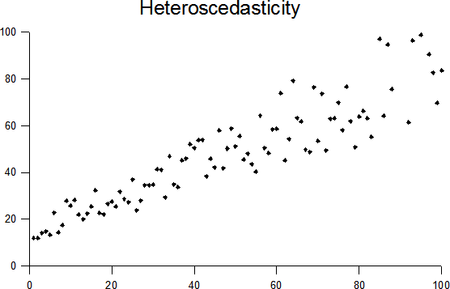

# Variance Ratio Test 

   

These statistical tests provide a descriptive tool for examing the stochastic evolution of prices through the time of a financial log price series. The implicit logic behind the test is to reject the Random Walk model (i.e., Efficient Markets Hypothesis) via comparing variances estimators at different sampling intervals.
The idea is to investigate the quality of the Efficiency of some financial instrument log price series under the two most commonly know null hypothesis:

- **Homoskedastic Increments** (*strong market efficiency*): the disturbances/increments are IID normal random variables, wherein the variance of its increments is a linear function in the observation interval. This hypothesis corresponds to the Brownian Motion model.

- **Heteroskedastic Increments** (*semi-strong market efficiency*): the disturbances/increments are independents but not identically distributed (INID). The variance of its increments is a non-linear function in the observation interval. This hypothesis corresponds to the Heston Model.

Suppose the test rejects the strong and the semi-strong forms of market efficiency. In that case, we can infer with enough statistical evidence that the **increments' variance has some form of predictability** in their structure. Therefore, the price series returns are conditioned to the prior prices or by *exogenous variable(s)*.

- **Model dependant increments** (*weak market efficiency*): The third form disturbances relax the independence assumption, meaning that it allows for conditional heteroskedastic increments. Therefore, the volatility either has some non-linear structure (conditional on itself) or conditional on another random variable. Stochastic processes that employ ARCH (Autoregressive Conditional Heteroscedasticity) and GARCH (Generalized AutoRegressive Conditional Heteroscedasticity) models of volatility belong to this category.

Please be aware that the Variance Ratio test results do not necessarily imply that the stock market is inefficient in the stock price formation or that prices are not rational assessments of fundamental values. The Variance Ratio test is purely a descriptive tool for examing the stochastic evolution of prices through time. For a detailed explanation of the test, please visit the papers in which this test is based:

- Lo, Andrew W. and MacKinlay, Archie Craig, Stock Market Prices Do Not Follow Random Walks: Evidence from a Simple Specification Test (February 1987). NBER Working Paper No. w2168. Available at SSRN: https://ssrn.com/abstract=346975

- Lo, Andrew W. and MacKinlay, Archie Craig, The Size and Power of the Variance Ratio Test in Finite Samples: a Monte Carlo Investigation (June 1988). NBER Working Paper No. t0066. Available at SSRN: https://ssrn.com/abstract=396681

Future releases will include:

- Distribution of the code in PiPy as a package.
- Include a step by step explanation of the Variance Ratio test in QuantConnect.
- Implementation of the Long Term Memory in Stock Market Prices paper of Andrew Lo. More details in the paper
Lo, Andrew W., Long-Term Memory in Stock Market Prices (May 1989). NBER Working Paper No. w2984. Available at SSRN: https://ssrn.com/abstract=463442
- Implementation of other market Efficiency tests.

Sources:

- Stuart Reid | On February. "Stock Market Prices Do Not Follow Random Walks." Turing Finance, 8 Feb. 2016, www.turingfinance.com/stock-market-prices-do-not-follow-random-walks/
- "Variance Ratio Test." Breaking Down Finance, [breakingdownfinance.com/finance-topics/finance-basics/variance-ratio-test/](breakingdownfinance.com/finance-topics/finance-basics/variance-ratio-test/)